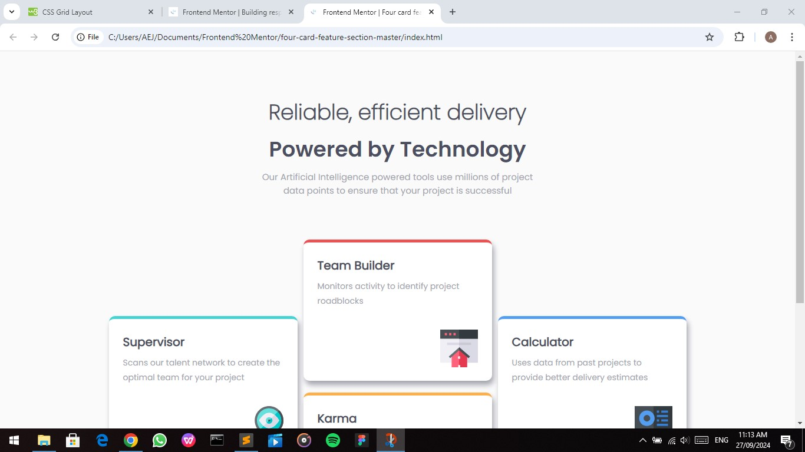

# Frontend Mentor - Four card feature section solution

This is a solution to the [Four card feature section challenge on Frontend Mentor](https://www.frontendmentor.io/challenges/four-card-feature-section-weK1eFYK).

## Table of contents

- [Overview](#overview)
  - [The challenge](#the-challenge)
  - [Screenshot](#screenshot)
  - [Links](#links)
- [My process](#my-process)
  - [Built with](#built-with)
  - [What I learned](#what-i-learned)
  - [Continued development](#continued-development)
  - [Useful resources](#useful-resources)
- [Author](#author)
- [Acknowledgments](#acknowledgments)


## Overview

### The challenge

Users should be able to:
- View the optimal layout for the site depending on their device's screen size

### Screenshot




### Links

- Solution URL: (https://github.com/Abas-code/)
- Live Site URL: (https://vercel.app/)

## My process

### Built with

- Semantic HTML5 markup
- CSS custom properties
- Flexbox
- Mobile-first workflow

### What I learned

I learnt how to manipulate elements using flexbox.

```css
section {
  max-width: 1000px;
  display: flex;
  justify-content: space-between;
  align-items: center;
}
.items {
  width: 32%;
  max-width: 300px;
}
```

### Continued development

I'm still trying to understand how to use variable fonts. 

```css
@font-face {
  font-family: 'FAMILY_NAME';
  font-stretch: PERCENTAGE_RANGE_LOW_TO_HIGH;  /* Note that font-stretch is a % of normal width */
  font-style: NORMAL_OR_ITALIC; /* See note below */
  font-weight: NUMERIC_RANGE_LOW_TO_HIGH;
  src: url(FONT_FILE_NAME.woff2) format('woff2');
}
```

### Useful resources

- [W3Schools](https://www.w3schools.com)


## Author

- Frontend Mentor - [@Abascode](https://www.frontendmentor.io/profile/Abascode)


## Acknowledgments

I want to acknowledge my friend, Emmanuel who pointed out to me the flex-direction property.